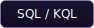
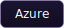
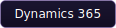
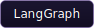
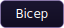

<!-- Hero -->

  

<!-- Typing line -->

  

I lead technology at **[Lucid Labs](https://lucidlabs.com.au)**, a Microsoft Solutions Partner and GitHub Partner helping Australian enterprise and government organisations modernise the way they build, govern, and deliver software. My work sits at the intersection of **Data & AI**, **Developer Platforms**, and the **responsible adoption** of both — translating strategy into production systems people actually use.

 

- Data & AI platform strategy
- Agentic AI & enterprise Copilot adoption
- GitHub Enterprise & DevSecOps modernisation
- AI governance, assurance & responsible-use

- Scaling Lucid Labs' Data & AI and GitHub practices
- Enterprise Microsoft Fabric & Purview modernisation
- Driving developer adoption of GitHub Copilot & Advanced Security

 

**Languages**

     

**Microsoft Cloud & Data**

         

**AI & Agentic Systems**

       

**Developer Platform & DevSecOps**

        

 

---

[**LinkedIn**](https://www.linkedin.com/in/keithoak) &nbsp;·&nbsp; [**lucidlabs.com.au**](https://lucidlabs.com.au) &nbsp;·&nbsp; [**koak@lucidlabs.com.au**](mailto:koak@lucidlabs.com.au)

  <em>Outside the terminal — gaming and a Golden Labrador named Obi Wan.</em>

