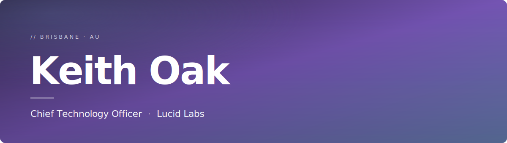

<!-- Hero -->

  

<!-- Typing line -->

  

I lead technology at **[Lucid Labs](https://lucidlabs.com.au)**, a Microsoft Solutions Partner and GitHub Partner helping Australian enterprise and government organisations modernise the way they build, govern, and deliver software. My work sits at the intersection of **Data & AI**, **Developer Platforms**, and the **responsible adoption** of both — translating strategy into production systems people actually use.

 

<table width="100%">
  <tr>
    <td width="50%" valign="top">
      <h3><code>// Practice areas</code></h3>
      <ul>
        <li>Data &amp; AI platform strategy</li>
        <li>Agentic AI &amp; enterprise Copilot adoption</li>
        <li>GitHub Enterprise &amp; DevSecOps modernisation</li>
        <li>AI governance, assurance &amp; responsible-use</li>
      </ul>
    </td>
    <td width="50%" valign="top">
      <h3><code>// Currently</code></h3>
      <ul>
        <li>Scaling Lucid Labs' Data &amp; AI and GitHub practices</li>
        <li>Enterprise Microsoft Fabric &amp; Purview modernisation</li>
        <li>Driving developer adoption of GitHub Copilot &amp; Advanced Security</li>
      </ul>
    </td>
  </tr>
</table>

 

### `// Stack`

**Languages**

**Microsoft Cloud & Data**

**AI & Agentic Systems**

**Developer Platform & DevSecOps**

 

---

[**LinkedIn**](https://www.linkedin.com/in/keithoak) &nbsp;·&nbsp; [**lucidlabs.com.au**](https://lucidlabs.com.au) &nbsp;·&nbsp; [**koak@lucidlabs.com.au**](mailto:koak@lucidlabs.com.au)

  <i>Outside the terminal — gaming and a Golden Labrador named Obi Wan.</i>

